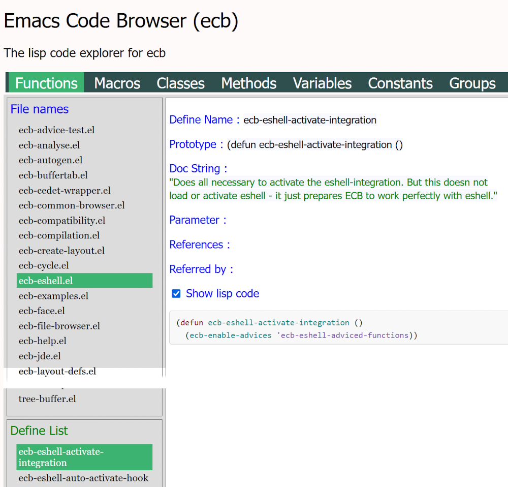

## LispDoc - A lisp code explorer for ecb ##

This contains a local html page (LispDoc.html) which shows the ecb code in explorer way.\
Here is a screenshot:



It shows the functions, defines, classes, macros and others for every file.\
At the top you can select the define, on the left side you can see all lisp files of ecb.\
The window below contains the found definitions in the selected file,
in this example the functions of ***ecb-shell.el**.

When you select one of this definitions, here ***ecb-eshell-activate-integration***,
then the details of this function are shown in the main window.\
It shows the name, prototype, docstring and parameter if they exist for the selected
definition.\
References and Referred to are not yet implemented.\
Below is a checkbox where you can show or hide the lisp code but the docstring is already
removed because it is already shown above.

### Usage ###

Open ***LispDoc.html*** in your default browser

### Update with new ecb ###

Just run the perl script in this directory with the path to ecb and the data folder:

    perl LispDoc.pl "../ecb" "./data"

#### Dependencies of the perl script ####

```
use File::Basename;
use File::Copy;
use File::Find;
use File::Slurp;
use File::Path qw (make_path);
use Cwd qw ( cwd abs_path chdir );
```
To run the perl script the dependencies must be fullfilled for example with

```
cpan install File::Basename;
cpan install File::Copy;
   ...
```

### How it works ###

It contains the perl script ***LispDoc.pl*** which parses all *.el file in the given folder,
in this example ecb.

The script searches for lisp definitions like functions, defines, classes,
macros, const and others.\
The found information is then written into several js files in the data directory.\
It uses javascript syntax because then it can be loaded directly in the ***LispDoc.html***
file.

The current browsers do not allow to load local files for security reason,\
therefore it is not possible to store and load the information in json format, but
**.js** is allowed.

In the html file you find the following includes at the end of the html body:

```
<script src="data/FilesData.js"></script>
<script src="data/Functions.js"></script>
<script src="data/Macros.js"></script>
<script src="data/Classes.js"></script>
<script src="data/Methods.js"></script>
<script src="data/Variables.js"></script>
<script src="data/Constants.js"></script>
<script src="data/Groups.js"></script>
<script src="data/Substs.js"></script>
<script src="data/Structs.js"></script>

<script type="text/javascript" src="scripts/JsUtils.js"></script>
<script type="text/javascript" src="scripts/LispDoc.js"></script>
<script type="text/javascript" src="scripts/LispHighlight.js"></script>
```

FileData.js contains the filenames in an array and then for every file an
array called **filesInfo**.\
This array contains an object for every file with filename and the found definitons
in this file (functions, macros ...).

The other javascript files in the data directory contain the details for all
functions, defines, classes, macros, const and others.\
This information is show in the main window.

The javascript file ***LispDoc.js*** contains the control logic for the interactivity.
All information from the javascript files in the data folder is available as objects
in ***LispDoc.js***. It contains all event handler / listener to allow a control flow.


